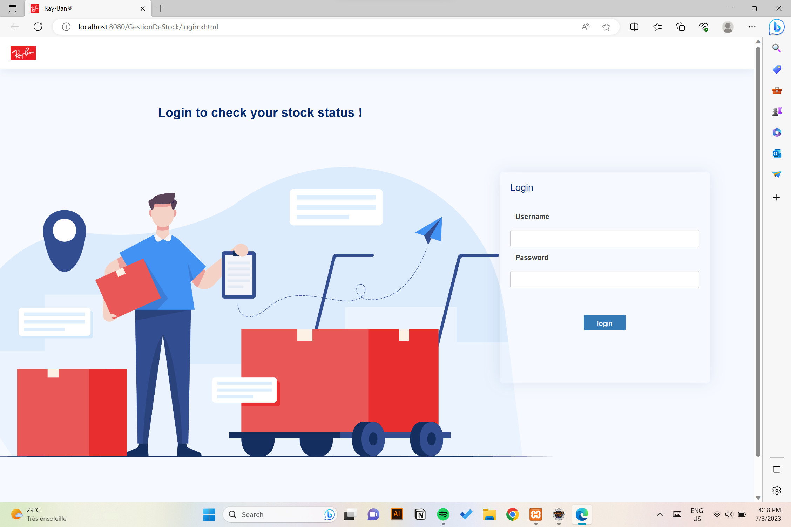
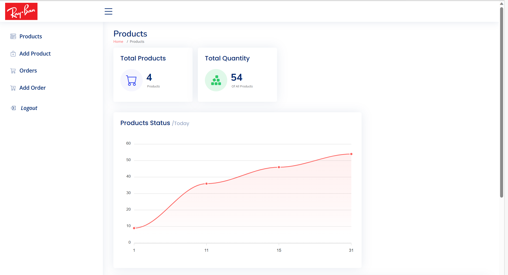
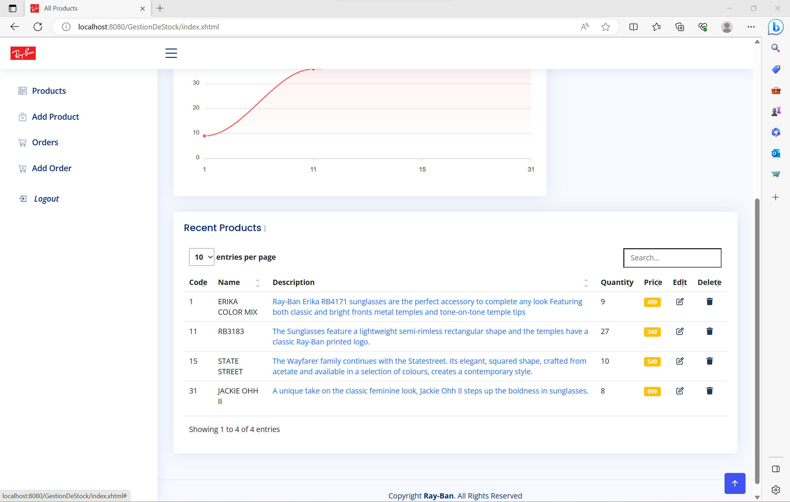
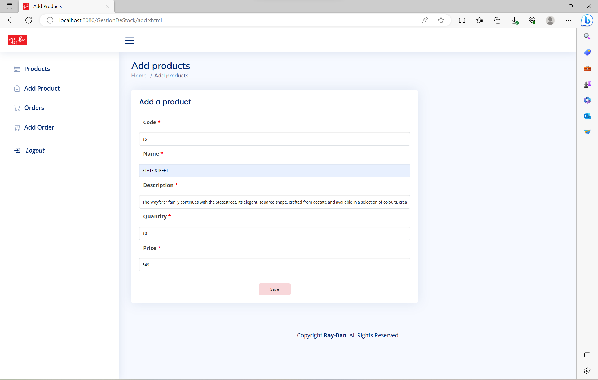
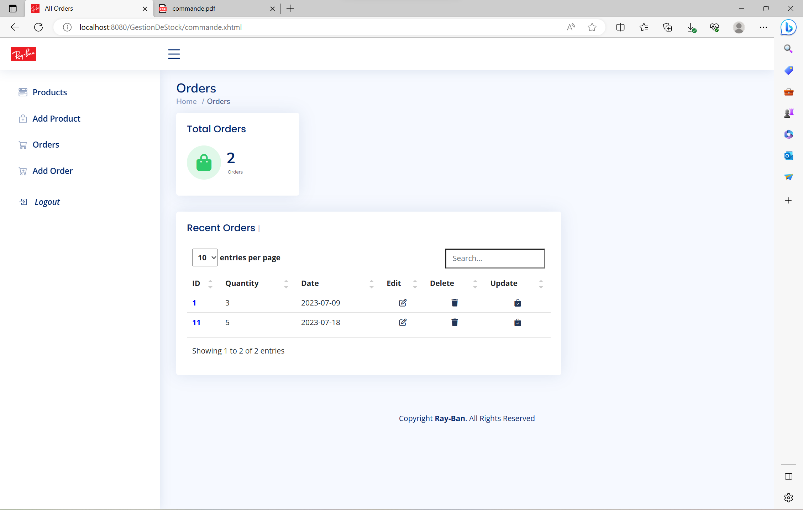
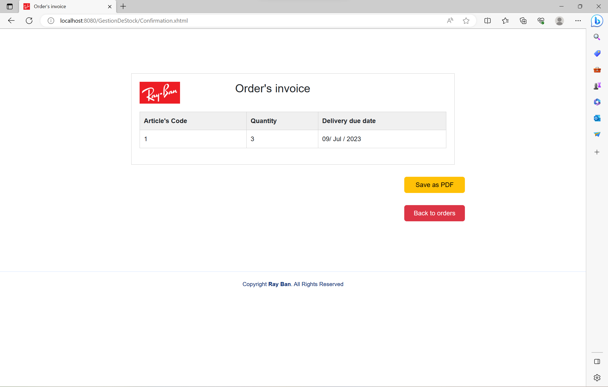

# Stock-Management-Web-Application_RAY-BAN-Company
 This project is a web application for stock management, considering the company RAY-BAN as a figure to work on. Using JEE, JSF, Spring Framework & Hibernate.
# Platform 

# This is the page showing the products of our stock

# This is the form to add a product to the stock

# This is the form to edit a product existing in stock 

# This is the page containing the orders we are expecting 

# Here is the invoice of the orders added 

